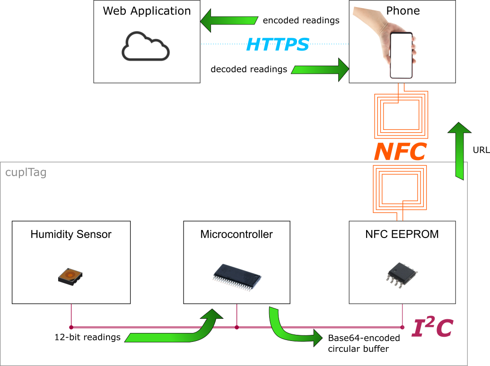

# cuplTag
The project comprises hardware and firmware. 

The firmware runs on a low power MSP430 microcontroller. It periodically reads temperature and humidity from an [HDC2022](https://www.ti.com/product/HDC2022) sensor. Readings are base-64 encoded and stored in a URL, which resides on an NFC EEPROM. 

When a phone is hovered over a cuplTag, the URL is read and a web browser opens ([demo](https://www.youtube.com/watch?v=ySxt_svazHo)). No app is required. The web application decodes, timestamps and displays readings to the user. 

## Key Features
- Average current consumption ~0.5uA. Runs for years on a CR1220 battery.
- Ease of use. No app to install on the Android / Apple phone.
- Data are automatically uploaded to the web.

[Buy one on Crowd Supply!](https://crowdsupply.com/cupl/cupltag)

## Pinout

J30 is a 2.54mm pitch 2x4 way header.

| Pin | Name | Direction | Description       | Note                           |
|-----|------|-----------|-------------------|--------------------------------|
| 1   | TX   | Output    | UART transmit     | Transmit from MSP430           |
| 2   | RX   | Input     | UART receive      | Receive to MSP430              |
| 3   | GND  |           | GND               |                                |
| 4   | TST  | Input     | Spy-Bi-Wire Clock | Also TEST signal for BSL entry |
| 5   | GND  |           | GND               |                                |
| 6   | nRST | I/O       | Spy-Bi-Wire Data  | Also active low RESET signal   |
| 7   | VDD  | Input     | Power in          | +3V3                           |
| 8   | nPRG | Input     | Prog. Mode Enable | Active low                     |

## User Documentation 

### Guides

* [Getting Started](docs/firmware/gettingstarted.rst) by loading the project into Code Composer.
* [Programming](docs/firmware/programming/index.rst) the MSP430.
* [Configuration with UART (1 of 2)](docs/guides/configUARTpt1/index.md).
* [Configuration with UART (2 of 2)](https://github.com/cuplsensor/cuplfrontend/blob/master/docs/guides/configUARTpt2/index.md) [cuplfrontend].
* [Configuration with NFC](docs/guides/configNFC/index.md).

### Interface

* [Configuration Strings](docs/specs/configstrings.rst)  that can be written over the serial port or NFC.

## Code Documentation

[ReadTheDocs](https://cupl.readthedocs.io/projects/tag/en/latest/)

## Licence

### Firmware

### Hardware

[CERN Open Hardware Licence Version 2 - Strongly Reciprocal](https://ohwr.org/cern_ohl_s_v2.txt)

### Documentation

