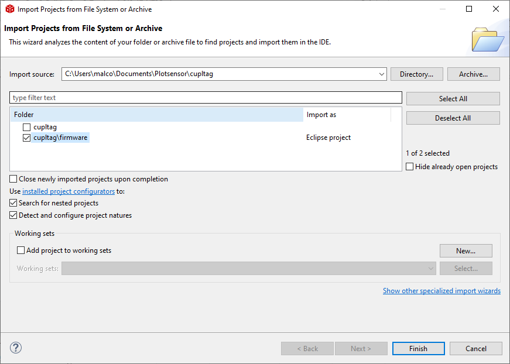
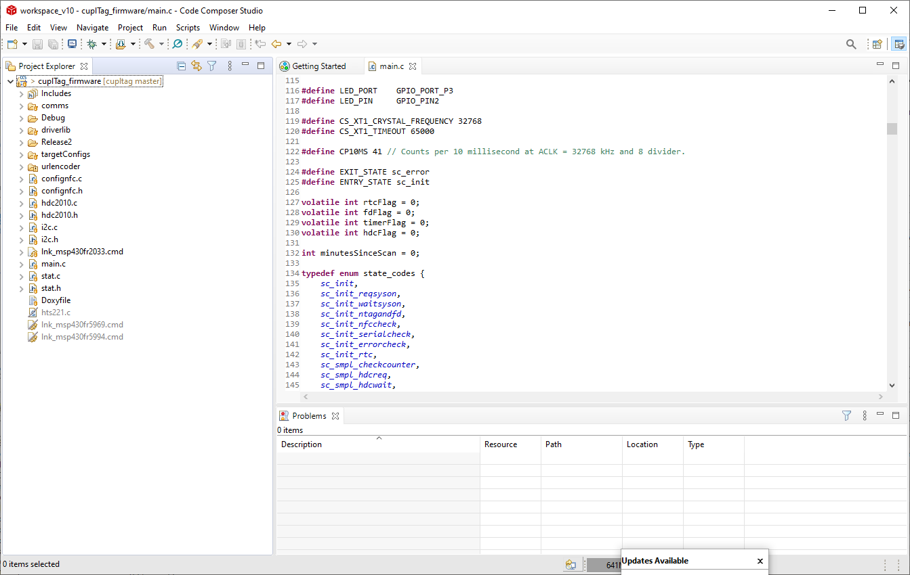

Getting Started
----------------

Prerequisites
~~~~~~~~~~~~~~~
* cupl Codec (`download <https://github.com/cuplsensor/cuplcodec/releases>`_).
* MSP-FET debugger (`TI <https://www.ti.com/tool/MSP-FET>`_).
* GitHub Desktop (`download <https://desktop.github.com/>`_) or your choice of Git software.

Fork and Clone the repository
~~~~~~~~~~~~~~~~~~~~~~~~~~~~~~~~

.. image:: fork-and-clone.png
   :width: 400

Visit the cupl Tag repository on (`GitHub <https://github.com/cuplsensor/cupltag>`_). Click the
fork button in the top right.

Clone the forked repository to your computer by clicking the green Clone or Download button. See
`<https://guides.github.com/activities/forking/>`_ for more details.

Open the Code Composer Project
~~~~~~~~~~~~~~~~~~~~~~~~~~~~~~~~

#. (`Download <https://software-dl.ti.com/ccs/esd/documents/ccs_downloads.html>`_) Code Composer Studio 10 (CCS).
#. Open CCS. Launch the workspace of your choice.
#. Click File -> Open Projects from File System...
#. In Import Source, select the local directory you cloned cupl Tag into earlier.

#. Ensure that cupltag\firmware is **checked**. Every other folder should be unchecked.
#. Click Finish.
#. The project is now open.

