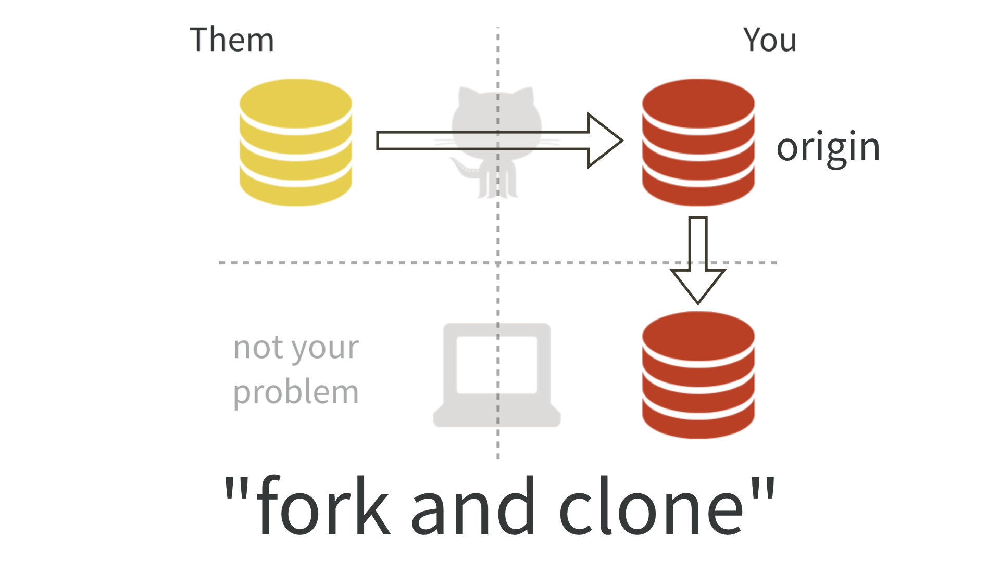

Getting Started
----------------

Prerequisites
~~~~~~~~~~~~~~~
* Code Composer Studio (`download <https://software-dl.ti.com/ccs/esd/documents/ccs_downloads.html>`_).
* cupl Codec (`download <https://github.com/cuplsensor/cuplcodec/releases>`_).
* MSP-FET debugger (`TI <https://www.ti.com/tool/MSP-FET>`_).
* GitHub Desktop (`download <https://desktop.github.com/>`_) or your choice of Git software.

Fork and Clone the repository
~~~~~~~~~~~~~~~~~~~~~~~~~~~~~~~~

Visit the cupl Tag repository on (`GitHub <https://github.com/cuplsensor/cupltag>`_). Click the
fork button in the top right.

Clone the forked repository to your computer by clicking the green Clone or Download button. See
`<https://guides.github.com/activities/forking/>`_ for more details.

