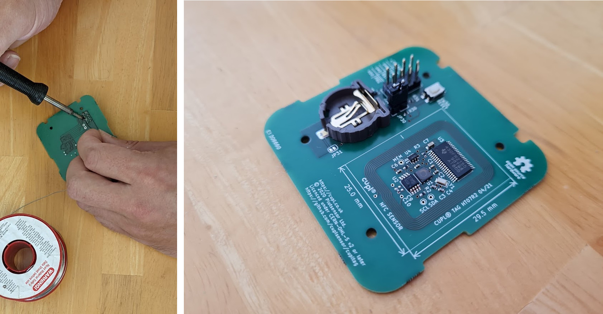
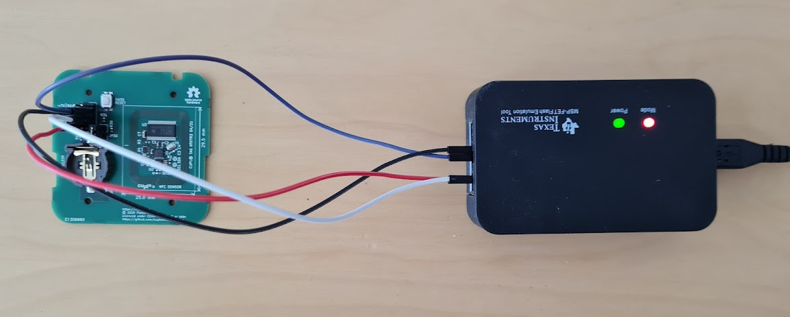

.. _Programming:

Programming
~~~~~~~~~~~~~

These instructions demonstrate how to program and debug the MSP430 on cuplTag.

Equipment
+++++++++++

.. figure:: whatyouwillneed.jpg
  :width: 70%
  :alt: Items needed to program the MSP430

You will need: 

* An MSP-FET with a USB cable.
* A PC running Code Composer Studio.
* 4 coloured jumper wires.
* A 2x4 way 2.54mm pitch pin header.
* A 1x2 way 2.54mm pitch pin header.
* A 2 way jumper.
* Solder.
* A cuplTag PCBA (HT07), unscrewed from the enclosure, with no battery inserted.

Populate the Headers
+++++++++++++++++++++

First, solder the pin headers onto J30 and JP30 of HT07. Use the jumper to short JP30. 
  

Make Connections
+++++++++++++++++

We will program / debug the MSP430 on HT07 using Spy-Bi-Wire. Connect it to the MSP-FET.

+---------+--------+--------------+-------------+--------------+-----------+
| Name    | Colour | MSP-FET name | MSP-FET pin | HT07 J30 pin | netname   |
+---------+--------+--------------+-------------+--------------+-----------+
| +3V3    | Red    | VCC_TOOL     | 2           | 7            | VDD       |
+---------+--------+--------------+-------------+--------------+-----------+
| GND     | Black  | GND          | 9           | 3            | GND       |
+---------+--------+--------------+-------------+--------------+-----------+
| SBWTDIO | White  | TDO/TDI      | 1           | 6            | nRST      |
+---------+--------+--------------+-------------+--------------+-----------+
| SBWTCK  | Purple | TCK          | 7           | 4            | TST       |
+---------+--------+--------------+-------------+--------------+-----------+

Program in CCS
+++++++++++++++++

#. Connect the MSP-FET to a PC with a USB cable. 
#. Open the Code Composer Studio cuplTag project `created earlier <GettingStarted>`.
#. Click on the Debug button. Wait for programming to complete.

Test
+++++

Test the program has loaded correctly by scanning HT07 with your phone. 

If JP30 is shorted, the MSP430 will boot into *programming mode*: The serial port is enabled and a status string is written to an NDEF text record on the tag.

