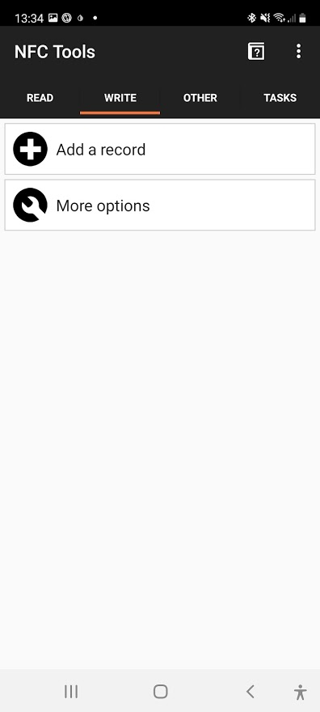
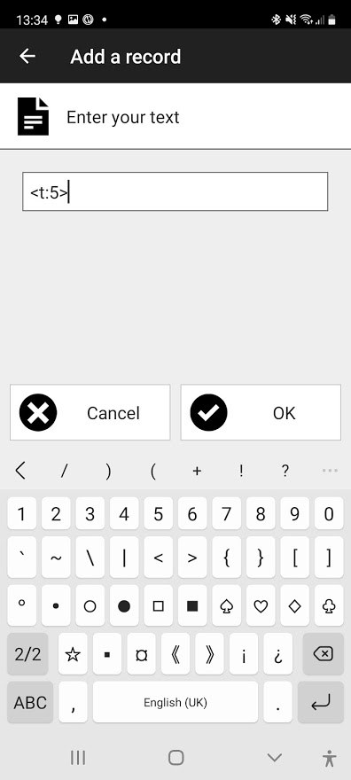
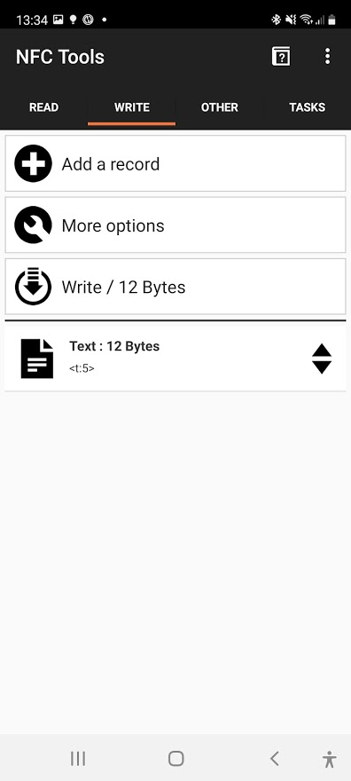
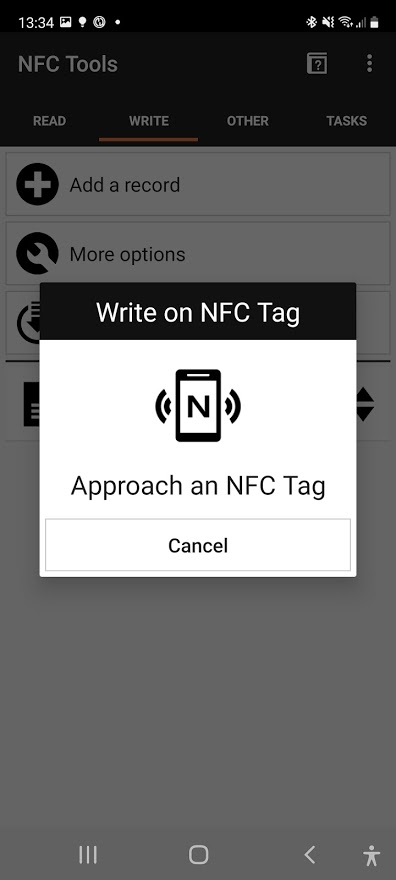
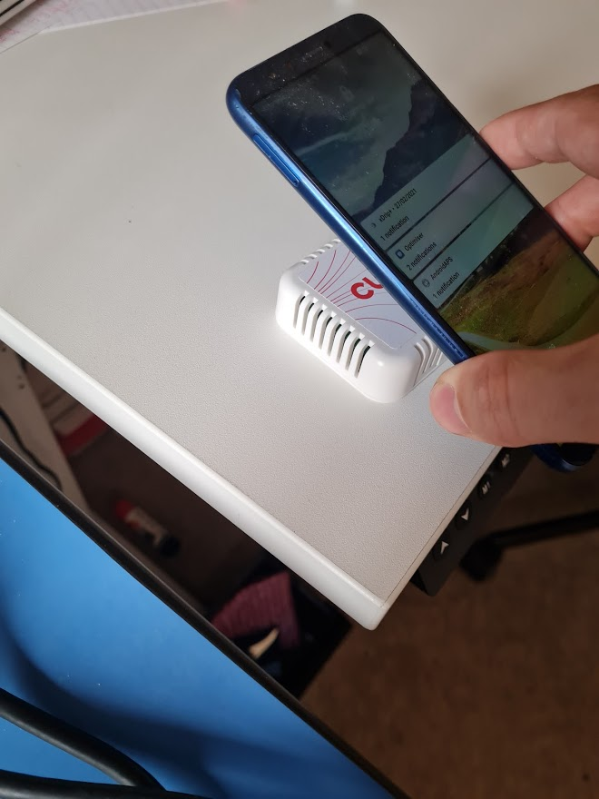
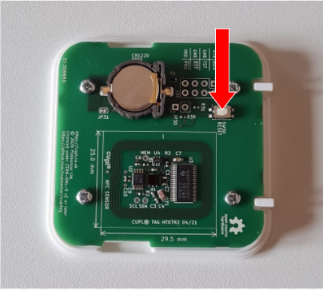

# Configure cuplTag with NFC

[Configuration strings](https://github.com/cuplsensor/cupltag/blob/master/docs/specs/configstrings.rst) can be written to the the tag inside an NDEF text record. 

The tag detects the text record and will reset within one minute. Strings are read and parsed on startup.

NFC configuration allows end users to make changes in the field. Most often this will be to the sample type or interval. In rare cases, the web application will go down and the base URL will need to be modified. If the tag is conformally coated, it is difficult to make a [wired connection](https://github.com/cuplsensor/cupltag/blob/master/docs/guides/configUARTpt1/index.md) after production. 

:fire: Do you use [**Chrome for Android V97+**](https://caniuse.com/webnfc)? Watch these [instructions](https://www.youtube.com/watch?v=UxrxsgZ2lA8) for an app-free alternative.

1. Download the NFC Tools app from [Google Play](https://play.google.com/store/apps/details?id=com.wakdev.wdnfc&hl=en_GB&gl=US) or the [iPhone](https://apps.apple.com/us/app/nfc-tools/id1252962749) App Store.
2. Select the **WRITE** tab. 
   
3. Select **Add a Record**.
4. Select **Text**.
5. Enter one or more configuration strings. Do not use spaces, carriage returns or separators between strings. 
   *The example below sets the time interval between samples to 5 minutes.*
   
6. Press **OK**.
7. The next screen shows the new NDEF text record inside an NDEF message. 
   
8. Select **Write**.
   
9. Tap to write the NDEF message.
   
10. Wait for one minute or press the RESET button. 
    

