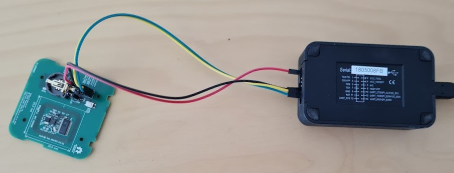
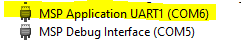
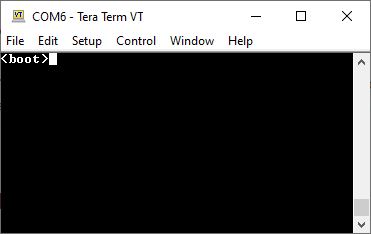
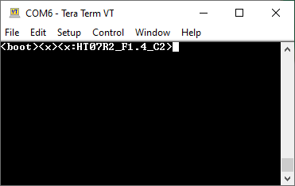

# Configure cuplTag with UART (Part 1 of 2)

A programmed cuplTag must be configured. The [sampling interval](https://github.com/cuplsensor/cupltag/blob/master/docs/specs/configstrings.rst#sample-interval-in-minutes) and other parameters are stored in non-volatile [Information Memory](https://www.ti.com/document-viewer/MSP430FR2155/datasheet/memory-organization-slasec43899#SLASEC43899). At startup, the MSP430 writes an error message to the [NT3H2111](https://www.nxp.com/docs/en/data-sheet/NT3H2111_2211.pdf) if configuration is incomplete.

## Equipment

You will need:

* A cuplTag PCBA (HT07). This must be [programmed](https://github.com/cuplsensor/cupltag/blob/master/docs/firmware/programming/index.rst#programming), with headers J30 and JP30 populated.
* 4 coloured jumper wires.
* A USB-to-serial converter. An [MSP-FET](https://www.ti.com/tool/MSP-FET) is used in this guide, but anything will do.
* A PC running [TeraTerm](https://ttssh2.osdn.jp/index.html.en).

## Make Connections

### JP30

Place the shorting jumper on HT07 JP30. This will cause *Programming Mode* to be invoked (and the serial port enabled) on startup.

### J30

| Name   | Colour | MSP-FET name | MSP-FET pin | J30 pin | J30 name |
| ------ | ------ | ------------ | ----------- | ------- | -------- |
| +3V3*  | Red    | VCC_TOOL     | 2           | 7       | VDD      |
| GND    | Black  | GND          | 9           | 3       | GND      |
| TX     | Yellow | UART_TXD     | 12          | 1       | <TX      |
| RX     | Green  | UART_RXD     | 14          | 2       | RX>      |

\*If the HT07 has a coin cell inserted, only GND, TX and RX are required.

## Test with TeraTerm

1. Connect the MSP-FET to a USB port on your PC.
2. Open TeraTerm.
3. Click Setup -> Serial Port...
4. **Port** the Application UART port for your MSP-FET. This can be found in device manager.

      
   
5. **Speed** 9600 baud
6. **Data** 8 bit.
7. **Parity** None.
8. **Stop bits** 1 bit.
9. **Flow control** None.
10. Click OK.
11. Press the RESET button on HT07. You will see `<boot>`.
    
      

12. Send `<x>`. The version string will be printed.
      
      

