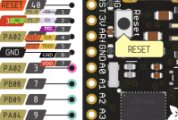

HT05 Module
-------------

.. _HT04Pinout:

Pinout
*******

+-----+------+-----------+-------------------------+---------------------------------------+
| Pin | Name | Direction | Description             | Note                                  |
+=====+======+===========+=========================+=======================================+
| 1   | TX   | Output    | UART transmit           |                                       |
+-----+------+-----------+-------------------------+---------------------------------------+
| 2   | RX   | Input     | UART receive            | Also ADC input A6                     |
+-----+------+-----------+-------------------------+---------------------------------------+
| 3   | nPRG | Input     | Select programming mode | Active low                            |
+-----+------+-----------+-------------------------+---------------------------------------+
| 4   | TCK  | Input     | Spy-Bi-Wire Clock       | Also TEST signal for BSL entry        |
+-----+------+-----------+-------------------------+---------------------------------------+
| 5   | TDIO | I/O       | Spy-Bi-Wire Data        | Also nRESET signal                    |
+-----+------+-----------+-------------------------+---------------------------------------+
| 6   | GND  |           | GND                     |                                       |
+-----+------+-----------+-------------------------+---------------------------------------+
| 7   | VDD  | Input     | Power in                |                                       |
+-----+------+-----------+-------------------------+---------------------------------------+
| 8+  | NC   |           | Not connected           |                                       |
+-----+------+-----------+-------------------------+---------------------------------------+
